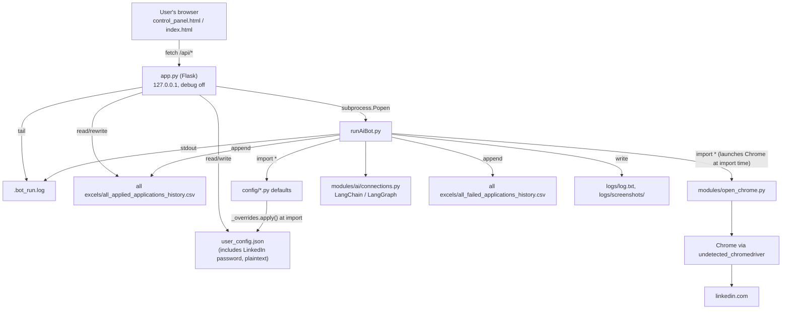

# ApplyXAI — Architecture Audit

Audit date: 2026-10-07 · Audited commit: `e0b2401` (plus one uncommitted change in `modules/open_chrome.py`, see §9.1)
Scope: read-only inspection. No application or automation code was changed during this audit.

Baseline test run (Windows, Python 3.12.10, `venv`):

```
242 passed, 1 skipped (live OpenAI smoke test, needs OPENAI_API_KEY) in 2.6s
```

`pytest` was not installed in `venv`; it was installed from the existing `requirements-dev.txt` to get this baseline.

---

## 1. Summary

The project is a **single-user, local desktop tool** (upstream: `GodsScion/Auto_job_applier_linkedIn`, MIT) with a small Flask "control panel" bound to `127.0.0.1`. The control panel writes one JSON file and launches the bot as a **subprocess**. The bot (`runAiBot.py`) is a ~1,600-line script that drives LinkedIn through Selenium + `undetected_chromedriver`, reads all configuration from **module-level globals**, and writes its results to **CSV files**.

It works well for its intended purpose. It is not multi-tenant in any way: there is no database, no authentication, no user concept, and every piece of state (config, Chrome profile, output files, logs, the running process) is a process-wide or machine-wide singleton.

The good news for the migration: the control panel already launches the bot as a separate process and talks to it only through files. That boundary is exactly where a worker/adapter can be inserted with very small changes to the engine.

---

## 2. Current architecture



### 2.1 Files and responsibilities

| Path | Lines | Role |
|---|---|---|
| `app.py` | 568 | Flask control panel: config API, bot start/stop/status/logs, history API, self-update |
| `runAiBot.py` | 1,594 | The automation engine: login, search, filters, job loop, Easy Apply, question answering, CSV output |
| `config_schema.py` | 297 | Single source of truth for every UI-editable setting (type, options, help text) |
| `config/_overrides.py` | 55 | Loads `user_config.json` and overwrites matching module globals |
| `config/{personals,questions,search,secrets,settings}.py` | — | Shipped defaults; each calls `_overrides.apply(__name__, globals())` at the bottom |
| `modules/open_chrome.py` | 119 | Chrome/driver creation; **creates the browser at import time** |
| `modules/clickers_and_finders.py` | — | Selenium helper primitives (XPath clicks, multi-select, scrolling) |
| `modules/helpers.py` | ~370 | Directories, Chrome profile paths, logging (`logger`, `print_lg`), timing, date parsing |
| `modules/validator.py` | 220 | Validates the config module globals (exact-string option lists) |
| `modules/ai/connections.py`, `prompts.py` | — | Provider-agnostic LLM client (OpenAI-compatible / Gemini), skill extraction, answer graph |
| `modules/updater.py` | — | Checks upstream GitHub `VERSION` and runs a `git pull` fast-forward |
| `templates/control_panel.html` | ~35 KB | Single-page settings + run UI, rendered from `/api/schema` |
| `templates/index.html` | ~15 KB | Applied-jobs history table |
| `start.bat` / `start.sh` / `start.command` | — | One-click launchers (create `.venv`, install deps, run `app.py`) |
| `run_tests.*` | — | Test launchers (also use `.venv`) |
| `tests/` | 13 files | 243 unit/integration tests, no real browser needed |

---

## 3. Entry points

| Entry point | How it is started | What it does |
|---|---|---|
| `python app.py` | Manually, or by `start.*` | Serves the control panel on `127.0.0.1:5000` (or `$PORT`, or a free port) |
| `python runAiBot.py` | By `app.py` via `subprocess.Popen`, or manually from a terminal | Runs the full automation once (or forever with `run_non_stop`) |
| `start.bat` | Double-click | Creates **`.venv`** (not `venv`), installs `requirements.txt`, sets `PANEL_OPEN_BROWSER=1`, runs `app.py` |
| `run_tests.bat` | Double-click | Creates `.venv`, installs runtime + dev deps, runs `pytest` |

Note: the current developer workflow uses `venv\` while the launchers use `.venv\`. Both work; they are simply two separate environments. `venv/` is not in `.gitignore` (it shows as untracked).

---

## 4. Configuration flow

1. Each `config/*.py` file defines defaults as module globals, then calls `_overrides.apply(__name__, globals())`.
2. `_overrides.apply` reads `user_config.json` (path fixed to the project root) and overwrites **only globals that already exist** in that module. Unknown keys can't inject names.
3. `runAiBot.py` does `from config.search import *` (and the same for personals, questions, settings, and a subset of secrets). Every setting becomes a **global variable of the bot module**.
4. `modules/validator.py` re-imports the same modules and validates them with exact-string option lists when `main()` starts.
5. The control panel (`app.py`):
   - Captures the pristine defaults at startup by temporarily disabling the override loader and reloading the config modules (`_load_defaults`).
   - `GET /api/config` returns defaults overlaid with the current `user_config.json`.
   - `POST /api/config` accepts only keys present in `config_schema.py`, coerces types, then read-modify-writes `user_config.json`.

Important consequences for SaaS:

- Configuration is **file-based and process-global**. There is exactly one config per machine.
- `POST /api/config` coerces types but does **not** enforce option lists for `list` fields. For example `experience_level: ["1"]` would be saved and only rejected later by `validate_config()` inside the bot run. The SaaS API must validate against the same lists *before* saving (see §8).
- Some settings that matter at runtime are not in the schema (e.g. `run_non_stop`, `file_name`, `logs_folder_path`, `stop_before_submit`, `pause_after_filters`), but `_overrides.apply` will still apply them if present in the JSON. This is useful: per-run output paths can be injected without touching the engine.

### 4.1 Validator values (must be preserved exactly)

From `modules/validator.py::validate_search`:

| Setting | Allowed values |
|---|---|
| `experience_level` (list) | `Internship`, `Entry level`, `Associate`, `Mid-Senior level`, `Director`, `Executive` |
| `job_type` (list) | `Full-time`, `Part-time`, `Contract`, `Temporary`, `Volunteer`, `Internship`, `Other` |
| `on_site` (list) | `On-site`, `Remote`, `Hybrid` |
| `date_posted` | `""`, `Any time`, `Past month`, `Past week`, `Past 24 hours` |
| `sort_by` | `""`, `Most recent`, `Most relevant` |
| `salary` | any string (UI offers `""`, `$40,000+` … `$200,000+`) |
| `search_terms` | list of strings, at least 1 |
| `switch_number` | int ≥ 1 |
| `current_experience` | int ≥ -1 |

These strings are passed straight to `multi_sel_noWait` / `wait_span_click`, which click LinkedIn filter labels **by visible text**. That is why they must never become numeric IDs.

---

## 5. Browser automation flow

1. `runAiBot.py` is imported/executed. The star import of `modules.open_chrome` **immediately creates a Chrome session** (module-level `createChromeSession()`), retrying with a guest profile on `SessionNotCreatedException`.
2. Driver resolution (`auto_manage_driver=True`): Selenium Manager resolves a chromedriver → copied into `uc.Patcher.data_path` as `chromedriver.exe` → UC applies its `cdc_` patch → (macOS only) ad-hoc re-sign → `uc.Chrome(driver_executable_path=...)`. On any failure it falls back to UC's own download.
3. Chrome profile: the user's real Chrome profile (`%LOCALAPPDATA%\Google\Chrome\User Data`) unless `safe_mode` is on (default `True`), in which case a fixed temp profile `C:\temp\auto-job-apply-profile` is used.
4. Non-interactive detection: if `run_in_background` or stdout is not a TTY (always the case when launched by `app.py`), all `pyautogui` dialogs are replaced with log lines and the pause settings are forced off.
5. `main()`: validate config → check resume file → open LinkedIn login → log in with stored credentials (or wait for manual login) → optionally create the AI client → `run()` → `apply_to_jobs(search_terms)`.
6. `apply_to_jobs`: for each search term, open search, `apply_filters()` (clicks filters by text), iterate virtualised job cards, skip already-applied/blacklisted/bad-word/experience/sponsorship mismatches, detect Easy Apply vs external, fill the multi-step modal with `answer_questions()`, upload resume, submit (or stop at Review for `stop_before_submit`), then append a row to the applied or failed CSV.
7. Counters (`easy_applied_count`, `failed_count`, `skip_count`, …) are module globals; a summary is logged in `finally`, and the driver is quit.

### 5.1 How `app.py` controls the bot

- `POST /api/run`: `Popen([sys.executable, runAiBot.py])` with stdout → `.bot_run.log`, new process group, PID in `.bot_run.pid`. One process per machine (single global `_bot_proc`).
- `POST /api/stop`: `taskkill /F /T` on Windows, `killpg(SIGTERM)` elsewhere. No graceful stop, no pause/resume.
- `GET /api/status`: `poll()` on the tracked process.
- `GET /api/logs?offset=N`: byte-offset tail of `.bot_run.log`.
- There is **no structured progress** channel: the UI only sees raw log text. Progress must be inferred from logs or from the CSV files.

---

## 6. Existing HTTP endpoints (`app.py`)

| Method | Path | Purpose | Notes |
|---|---|---|---|
| GET | `/` | Control panel page (+ injected update bar) | |
| GET | `/history` | Applied-jobs history page | |
| GET | `/applied-jobs` | Applied CSV → JSON | Returns `str(e)` on error |
| PUT | `/applied-jobs/<job_id>` | Stamp "Date Applied" = now | Rewrites the CSV |
| GET | `/api/schema` | `config_schema.SCHEMA` | |
| GET | `/api/config` | Effective config | **Includes LinkedIn username/password and AI API key** |
| POST | `/api/config` | Save config | Type coercion only, no option-list validation |
| POST | `/api/run` | Start bot subprocess | |
| POST | `/api/stop` | Kill bot process tree | |
| GET | `/api/status` | Running? + PID | |
| GET | `/api/logs` | Incremental log tail | |
| GET | `/api/update-check` | Compare local vs upstream `VERSION` | Network call to GitHub |
| POST | `/api/update` | Freeze config then `git pull` | Pulls **upstream GodsScion repo** |

No authentication on any endpoint. Response shapes are inconsistent (`{"error": ...}`, raw lists, `{"running": ...}`).

---

## 7. Database, authentication, and multi-user status

- **Database:** none. Persistent data = `user_config.json` + two CSV files + log files + screenshots.
- **Authentication:** none. Security relies entirely on binding to `127.0.0.1`.
- **Users:** none. One implicit user = whoever is sitting at the machine.
- **Background jobs:** a single subprocess tracked in memory by Flask.
- **Existing local data to migrate later:** `all excels/all_applied_applications_history.csv` (~21 KB) and `all_failed_applications_history.csv` (~84 KB) can be imported as the first user's `jobs` + `applications` rows.

---

## 8. Important dependencies

From `requirements.txt` (mostly unpinned):

| Package | Pinned | Use | SaaS notes |
|---|---|---|---|
| `selenium` | no | Browser automation | Pin before containerising |
| `undetected-chromedriver` | no | Patched chromedriver | Last release 3.5.5 (Feb 2024), project abandoned upstream (see §10.4) |
| `setuptools` | no | Needed by UC on Python 3.12 | |
| `pyautogui` | no | Blocking dialogs, `keep_screen_awake` key presses | Needs a display; fails/hangs on headless Linux workers |
| `langchain==1.3.14`, `langchain-openai==1.4.2`, `langchain-google-genai==4.3.2`, `langgraph==1.2.10` | yes | AI answers / skills | Fine to reuse |
| `flask`, `flask-cors` | no | Control panel | |
| `pytest>=8,<9` (dev) | range | Tests | |

---

## 9. Known technical debt and risks

### 9.1 The ChromeDriver `.exe` fix is uncommitted

`modules/open_chrome.py` has a local, uncommitted change: `target = os.path.join(uc.Patcher.data_path, "chromedriver.exe")`. It is required on this Windows machine and must **not** be reverted. It should be committed. On Linux/macOS (future Docker workers) a file named `chromedriver.exe` still executes, because the name doesn't matter there, but it reads oddly. A platform-conditional name (`"chromedriver.exe" if os.name == "nt" else "chromedriver"`) is a tested-safe follow-up only once a test covers it. Not changed in this audit.

### 9.2 Security issues in the current control panel (exist today)

1. **Credential exfiltration via wide-open CORS.** `CORS(app)` allows any origin. While the panel is running, any web page the user visits can `fetch("http://127.0.0.1:5000/api/config")` and read the LinkedIn password and AI API key, or `POST /api/run` / `/api/config`. Binding to localhost does not protect against this. **Recommended immediate fix:** remove `CORS(app)` (the panel is same-origin and doesn't need it) and stop returning password values from `GET /api/config`.
2. Plaintext LinkedIn password and AI API key in `user_config.json`. It is gitignored, but still unencrypted on disk.
3. `/api/update` runs `git pull` against the upstream repository. In a commercial fork this would pull third-party code into production. It must be disabled or pointed at your own release channel.
4. Error responses return raw exception text (`str(e)`).

### 9.3 Blockers for multi-user operation

| Blocker | Where | Why it matters |
|---|---|---|
| Config is module globals loaded at import | `config/*.py`, `from config.x import *` in `runAiBot.py`, `validator.py`, `open_chrome.py`, `helpers.py`, `ai/connections.py`, `clickers_and_finders.py` | Two users can never run in the same Python process. Isolation must be **one OS process per run** until the engine is refactored |
| Config file path is fixed | `_overrides.USER_CONFIG_PATH` | Need a way to point a run at a per-user/per-run config file |
| Chrome launched at import time | `modules/open_chrome.py` bottom | Importing the engine has side effects. Can't be imported by an API/worker process for introspection |
| Shared Chrome profile | `helpers.get_default_temp_profile()` (`C:\temp\auto-job-apply-profile`) or the real Chrome profile | Concurrent runs would share cookies/LinkedIn sessions: User A could act as User B |
| Shared output paths | `file_name`, `failed_file_name`, `logs_folder_path`, `.bot_run.log`, screenshots | History, failures, and logs of all users would mix |
| Single process tracking | `app.py::_bot_proc` | One run per machine |
| `pyautogui` host side effects | `keep_screen_awake` presses Shift on the host; dialogs need a display | Unsafe on a shared worker; breaks on headless Linux |
| Manual steps | Manual login fallback, `pause_before_submit`, `pause_at_failed_question` | Need a human at the browser; impossible on a remote headless worker |
| No structured progress | Only free-text logs + CSV appends | Dashboard needs per-job events (applied/failed/skipped, current job) |
| No cooperative stop/pause | Process is killed | Killing mid-application can leave half-submitted drafts; pause is not possible |

### 9.4 General code-health debt

- `runAiBot.py` is a 1,600-line script relying on `global` statements and star imports; most logic is inside one ~300-line function (`apply_to_jobs`).
- Selenium selectors are tied to LinkedIn's current UI and drift (several recent commits fix "LinkedIn UI drift").
- Mutable default args in `validator.py` (`options: list=[]`) are harmless today but a smell.
- `print_lg` swaps a shared handler terminator; the code itself notes it needs a lock if threaded.
- Unpinned runtime dependencies make Docker builds non-reproducible.
- `logs/log.txt` is ~480 KB and `.bot_run.log` ~160 KB on this machine (both gitignored, rotated/truncated by design).

---

## 10. Platform, legal, and licensing considerations

These don't block the engineering work, but they change architecture decisions and should be decided by the product owner before launch.

1. **LinkedIn terms.** LinkedIn's User Agreement prohibits using bots or other automated methods to access the service, apply to jobs, or scrape data. Running this engine as a hosted commercial service, on users' accounts, from datacenter IPs, multiplies the risk of account restrictions for your customers and of legal claims against the operator. There is no official LinkedIn API for submitting Easy Apply applications.
2. **Existing evasion techniques.** The engine already uses `undetected_chromedriver` (patches chromedriver specifically to avoid bot detection) and human-like typing jitter. Per the project rules I will **preserve** the existing engine and **not add** any new detection-evasion, CAPTCHA-solving, or rate-limit circumvention. The driver layer should become pluggable so a non-evasive backend (plain Selenium already exists via `auto_manage_driver=False`), or official/permitted integrations, can replace it.
3. **Third-party credentials.** Collecting and storing customers' LinkedIn passwords on your servers is high-risk. It breaks on 2FA/CAPTCHA challenges, and it makes you a high-value target. Section 4 of the roadmap recommends a design where credentials never leave the user's machine.
4. **MIT license.** Commercial use is allowed, but the upstream copyright and license notice (`LICENSE`, `NOTICE`, file headers) must be kept in the distributed/hosted product. Upstream sponsor dialogs and links in `runAiBot.py` are cosmetic and can be rebranded, but the copyright attribution must stay.

---

## 11. What can be reused, what must change

### Reuse as-is

- The entire automation engine (`runAiBot.py`, `modules/clickers_and_finders.py`, `modules/ai/*`, question-matching logic), run in its own process.
- `config_schema.py`: field definitions, labels, help text, and option lists are a ready-made source for API validation and frontend forms.
- `modules/validator.py` option lists (import them as the single source of truth instead of copying them).
- `config/_overrides.py` mechanism: a per-run JSON overlay is exactly how the worker will feed user-specific config to the engine.
- The ChromeDriver resolution shim, including the `.exe` target.
- All 243 existing tests.
- `app.py` and the templates, kept as the local "classic" mode during the whole migration.

### Small, low-risk engine hooks needed (Phase 7, each behind tests)

1. `_overrides.USER_CONFIG_PATH` honours an environment variable (e.g. `APPLYXAI_RUN_CONFIG`), defaulting to today's path.
2. Chrome temp-profile path honours an environment variable (per-user profile directory).
3. Output paths (`file_name`, `failed_file_name`, `logs_folder_path`) are already overridable through the JSON overlay; no code change needed.
4. An optional structured event sink: a JSON-lines file written next to the CSV appends (`applied`, `failed`, `skipped`, `current_job`, `summary`). The worker tails it and writes DB rows.
5. An optional cooperative control file checked between jobs (`stop` / `pause`) so runs can stop cleanly instead of being killed mid-application.

With no environment variables set, all of these behave exactly as today, so `python app.py` and `python runAiBot.py` keep working unchanged.

### Must be refactored later (after the adapter has tests)

- Remove import-time Chrome launch (move into an explicit `create_session()` called by `main()`).
- Replace star-imported globals with an explicit `RunConfig` object passed into the engine.
- Replace `pyautogui` dialogs with an injectable "interaction" interface (no-op / log / web prompt).
- Split `apply_to_jobs` into testable units (search, card parsing, Easy Apply flow, persistence).

---

## 12. Recommended migration strategy (summary)

Build the SaaS **around** the engine, not inside it:

```
React SPA ──> FastAPI (/api/*) ──> PostgreSQL
                    │
                    └──> Redis ──> Celery worker ──> AutomationService adapter
                                                       │  writes per-run config JSON
                                                       │  sets env (config path, profile dir, output dir)
                                                       └──> subprocess: python runAiBot.py (unchanged engine)
                                                              │
                                                              └── events.jsonl / CSV ──> worker ──> DB rows
```

Key decisions (details and alternatives in `docs/SAAS_ROADMAP.md`):

- **Process-per-run isolation** is the only safe way to run the current engine for multiple users. It needs no engine rewrite.
- **Keep Flask `app.py`** as the local classic mode until the new stack fully replaces it. New code lives in `backend/` and `frontend/` and never imports `runAiBot.py`.
- **Recommended execution model: a user-side worker ("local agent")** that runs the engine on the customer's own computer, with the SaaS as the control plane. This keeps LinkedIn credentials and sessions on the user's machine, keeps manual login and "pause before submit" possible, and avoids running shared-IP browser farms. Server-side workers remain possible with the same adapter, but carry the risks in §10.
