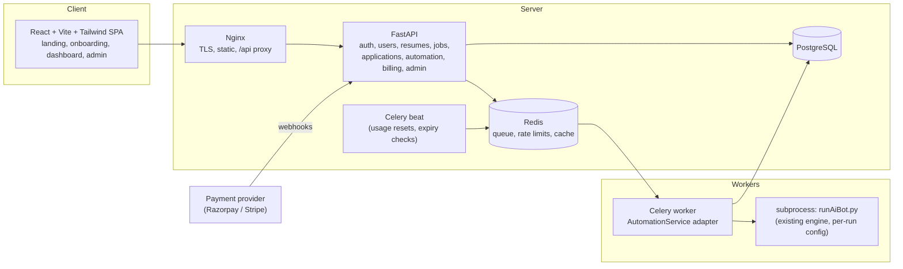

# ApplyXAI — SaaS Roadmap

Companion to `docs/ARCHITECTURE_AUDIT.md`. This is a proposal awaiting approval; nothing below has been implemented yet.

Guiding rules:

- The existing engine (`runAiBot.py` + `modules/`) is the product. It is wrapped, never duplicated or rewritten wholesale.
- `python app.py` on Windows (`venv`) keeps working after every phase.
- Every phase ends with the full test suite green (baseline: 242 passed, 1 skipped) and a manual smoke run of the existing automation.
- No new detection-evasion, CAPTCHA solving, or rate-limit circumvention is added.

---

## 1. Target architecture



### 1.1 Repository layout (target, reached incrementally)

```
applyxainew/
├── app.py, runAiBot.py, config_schema.py   # unchanged classic mode
├── config/, modules/, templates/            # unchanged engine + panel
├── automation/                              # NEW: thin integration package
│   ├── run_config.py                        # DB config -> engine JSON overlay (uses validator lists)
│   ├── runner.py                            # launches runAiBot.py subprocess with per-run env
│   └── events.py                            # parses events.jsonl / CSV into typed events
├── backend/
│   ├── app/{main.py, core/, models/, schemas/, api/, services/, workers/}
│   ├── alembic/ + alembic.ini
│   └── requirements.txt
├── frontend/                                # Vite + React + TS + Tailwind
├── docker/                                  # Dockerfiles, nginx.conf
├── docker-compose.yml, .env.example
├── tests/                                   # existing engine tests (untouched)
└── backend/tests/                           # new API/service/security tests
```

`backend/` never imports `runAiBot.py`. It only imports `config_schema.py` and the option lists, and talks to the engine through `automation/`.

---

## 2. Technology decisions

| Area | Recommendation | Why | Alternatives considered |
|---|---|---|---|
| API | **FastAPI** + Pydantic v2 | Typed validation, OpenAPI docs for free, async-friendly | Extend Flask (rejected: no typed schemas or OpenAPI without extra libs) |
| ORM / migrations | **SQLAlchemy 2.0** + **Alembic** | Standard, works with Postgres and SQLite (tests) | |
| Database | **PostgreSQL 16** | Relational data, JSONB for flexible config/answers, row-level filtering | |
| Test DB | SQLite in-memory for unit tests, Postgres in CI for integration | Fast local tests on Windows with no services | |
| Queue | **Redis 7 + Celery 5** | Mature, retries, revocation, beat scheduler; runs on Windows with `--pool=solo`/`threads` for dev | RQ (rejected: needs `fork`, doesn't run natively on Windows) |
| Frontend | **React + Vite + TypeScript + Tailwind**, React Router, TanStack Query | Matches the requested `src/pages` layout; simple static deploy behind Nginx | Next.js (only worth it for SSR/SEO; the landing page can be pre-rendered later if needed) |
| Charts | Recharts | Small, React-native | |
| Password hashing | **Argon2id** (`argon2-cffi` via `pwdlib`) | Current OWASP recommendation | bcrypt (acceptable fallback) |
| Rate limiting | `slowapi` with Redis storage | Per-IP and per-account limits on auth routes | |
| Email | SMTP via env config, sent from a Celery task; console backend in dev | Provider-agnostic | |
| Containers | Docker + docker compose, Nginx reverse proxy | As requested | |

---

## 3. Data model (Phase 2–4)

All tables have `id` (UUID), `created_at`, `updated_at`. Every user-owned table has a non-null, indexed `user_id` FK.

| Table | Key fields | Notes |
|---|---|---|
| `users` | email (unique, lowercased), password_hash, first/last name, is_active, is_verified, is_admin, last_login_at | |
| `user_profiles` | user_id (unique), phone, headline, summary, skills (JSONB), preferred_locations/roles (JSONB), experience_years, current_title, current_company | Maps onto `personals` / `questions` config sections |
| `search_configs` | user_id (unique), keywords, location, easy_apply_only, experience_level[], job_type[], on_site[], companies[], date_posted, salary_min/max, plus the remaining schema fields as JSONB | Validated against `modules/validator.py` lists |
| `application_preferences` | user_id, the `questions`/`settings` answers (JSONB) | Validated against `config_schema.py` |
| `resumes` | user_id, name, filename (original, display only), storage_path (generated UUID name), file_type, file_size, sha256, is_default | Partial unique index: one default per user |
| `jobs` | platform, external_id, title, company, location, job_url, description, salary_min/max, employment_type, work_setting, experience_level, discovered_at | Unique `(platform, external_id)`; indexes on platform, company, title, discovered_at. Shared catalogue: users see jobs only through their own `applications` |
| `applications` | user_id, job_id, resume_id, automation_job_id, status, applied_at, failure_reason, external_application_id | Unique `(user_id, job_id)`; status enum: discovered, queued, running, applied, failed, skipped, external, cancelled |
| `automation_jobs` | user_id, status, started_at, finished_at, current_job, total/successful/failed/skipped counts, error_message, celery_task_id, worker_id | Status enum: queued, running, paused, completed, failed, cancelled. Partial unique index: at most one active run per user |
| `automation_logs` | automation_job_id, user_id, ts, level, event, message (redacted) | Feeds the live log panel |
| `plans` | code (free/starter/pro/premium), name, limits (JSONB), price_cents, currency, interval, provider_price_id, is_active | Central plan config; seeded from a settings file, editable by admin |
| `subscriptions` | user_id, plan_id, status, provider, provider_customer_id, provider_subscription_id, current_period_start/end, cancel_at_period_end | Status changes only via verified webhooks |
| `payments` | user_id, subscription_id, provider, provider_payment_id (unique), amount, currency, status, raw_event_id | Idempotent webhook processing |
| `usage_counters` | user_id, period (YYYY-MM), applications, jobs_discovered, runtime_seconds | Incremented atomically by the worker |
| `notifications` | user_id, type, title, body, read_at | In-app; email sent via task |
| `auth_tokens` | user_id, purpose (verify_email / reset_password / refresh), token_hash, expires_at, used_at | Only hashes are stored |

On "jobs" scoping: the spec's `jobs` table has no `user_id`. A shared job catalogue avoids storing the same LinkedIn posting once per user. User-facing `/api/jobs` endpoints then **always join through `applications.user_id = current_user.id`**, so no user can enumerate jobs they never touched. If you'd rather have strictly per-user job rows, add `user_id` to `jobs`; the API rules stay the same.

### 3.1 Config mapping (the critical adapter)

`automation/run_config.py` builds the exact JSON structure `config/_overrides.py` already understands:

```json
{
  "personals": {"first_name": "...", "phone_number": "..."},
  "questions": {"years_of_experience": "3", "default_resume_path": "<per-run copy of default resume>"},
  "search":    {"search_terms": ["Python Developer"], "experience_level": ["Entry level"], "job_type": ["Full-time"], "on_site": ["Remote"]},
  "settings":  {"file_name": "<run_dir>/applied.csv", "failed_file_name": "<run_dir>/failed.csv", "logs_folder_path": "<run_dir>/logs/"},
  "secrets":   {"use_AI": false}
}
```

Validation happens twice: Pydantic schemas built from `config_schema.py` and `modules/validator.py` option lists at save time (API returns `422 VALIDATION_ERROR`), and the engine's own `validate_config()` at run start as a safety net. Values like `["1"]` or `["permanent"]` are rejected at the API.

---

## 4. Automation execution model (decision needed)

The same `AutomationService` adapter supports both models; the choice decides where the worker process runs.

### Option A (recommended): user-side worker ("ApplyXAI Agent")

- A small packaged program on the customer's computer: the existing engine plus a tiny client that authenticates to the API with a device token, polls for queued runs, executes them locally, and streams events back.
- LinkedIn credentials and browser sessions **never leave the user's machine**. Manual login, 2FA, and "pause before submit" still work because a human is present.
- Pros: lowest account-ban risk, no browser farm cost, no stored third-party passwords, closest to today's working setup.
- Cons: the user must keep their computer on while it runs; you have to package and update an installer.

### Option B: server-side workers

- Celery workers in Docker run headless Chrome per run, with an isolated profile directory per user.
- Requires storing LinkedIn session cookies or passwords server-side (encrypted with a KMS-managed key), can't handle 2FA/CAPTCHA without a human, and runs from datacenter IPs.
- Pros: fully hands-off for the user. Cons: highest platform/legal risk (see audit §10), significant infra cost (one Chrome ≈ 0.5–1 GB RAM), and `pyautogui` must be stubbed on Linux.

Either way, development starts identically: a Celery worker on the same machine launching `runAiBot.py` as a subprocess, which is effectively Option A running locally.

### 4.1 AutomationService contract

```python
class AutomationService:
    def start(self, user_id) -> AutomationJob      # checks plan limits + no active run, creates row, enqueues task
    def stop(self, job_id, user_id) -> AutomationJob     # writes control "stop"; hard-kill after timeout
    def pause(self, job_id, user_id) -> AutomationJob    # writes control "pause"; engine idles between jobs
    def resume(self, job_id, user_id) -> AutomationJob
    def get_status(self, job_id, user_id) -> AutomationJob
```

The worker task:

1. Loads the user's config from the DB, builds the overlay JSON, and validates it.
2. Creates `runs/<user_id>/<job_id>/` with the config, output dir, and a copy of the default resume.
3. Launches `python runAiBot.py` with `APPLYXAI_RUN_CONFIG`, `APPLYXAI_PROFILE_DIR` (per user), and `APPLYXAI_CONTROL_FILE`, using the same process-group handling `app.py` already uses.
4. Tails `events.jsonl` (and the CSVs as a fallback) and upserts `jobs`, `applications`, `usage_counters`, `automation_logs`.
5. Enforces the plan's monthly application limit by writing `stop` to the control file when it is reached.
6. On exit, sets the final status and counts and sends notifications.

---

## 5. Authentication and authorization

- Register → Argon2id hash → verification email (single-use token, 24h, stored hashed) → login allowed only for verified users in production.
- Login issues a **short-lived access JWT (15 min) and a rotating refresh token**, both in `HttpOnly; Secure; SameSite=Lax` cookies. Refresh tokens are stored hashed and revoked on logout or reuse.
- CSRF: double-submit token header (`X-CSRF-Token`) required on all state-changing requests, because auth uses cookies.
- Password reset: single-use token (1h), all sessions revoked on success. Responses never reveal whether an email exists.
- Rate limits: login 5/min per IP and 10/hour per account; register, reset, and verify-resend limited too.
- Authorization: a `get_current_user` dependency on every user route, a `require_admin` dependency on `/api/admin/*`, and repository helpers that **require** `user_id` (e.g. `ResumeRepo.get(user_id, resume_id)`), so an unscoped query isn't possible by accident. Cross-user access returns `404`, not `403`, to avoid leaking existence.

---

## 6. API design

Base: `/api`, OpenAPI at `/api/docs`. Envelope:

```json
{"success": true, "data": {}}
{"success": false, "error": {"code": "VALIDATION_ERROR", "message": "Invalid job type", "details": [...]}}
```

Global exception handlers map validation, auth, permission, not-found, rate-limit, and plan-limit errors to codes. Unhandled errors return `INTERNAL_ERROR` with a request ID; tracebacks are logged server-side only.

| Group | Endpoints |
|---|---|
| Auth | `POST /auth/register`, `/auth/login`, `/auth/logout`, `/auth/refresh`, `/auth/verify-email`, `/auth/resend-verification`, `/auth/forgot-password`, `/auth/reset-password`; `GET /auth/me` |
| Profile | `GET/PUT /profile` |
| Preferences | `GET/PUT /preferences/search`, `GET/PUT /preferences/application`, `GET /preferences/options` (option lists from the validator, used by the frontend) |
| Resumes | `GET/POST /resumes`, `PATCH/DELETE /resumes/{id}`, `POST /resumes/{id}/default`, `GET /resumes/{id}/download` |
| Jobs | `GET /jobs`, `GET /jobs/{id}` (scoped through the user's applications) |
| Applications | `GET /applications` (filters: status, date range, company, title, q; paginated), `GET /applications/{id}` |
| Automation | `GET /automation` (current + recent runs), `POST /automation/start`, `POST /automation/{id}/pause\|resume\|stop`, `GET /automation/{id}/logs?after=` |
| Dashboard | `GET /dashboard/stats` |
| Usage / billing | `GET /usage`, `GET /subscription`, `GET /plans`, `POST /billing/checkout`, `POST /billing/cancel`, `POST /billing/webhook/{provider}` |
| Notifications | `GET /notifications`, `POST /notifications/{id}/read` |
| Admin | `GET /admin/analytics`, `/admin/users`, `/admin/subscriptions`, `/admin/automation-jobs`, `/admin/applications`, `/admin/logs`, `/admin/workers`; `PATCH /admin/users/{id}`; `GET/PUT /admin/plans` |

Live updates: polling `GET /automation/{id}` + `/logs?after=<cursor>` every 2–3s via TanStack Query (simple, works through any proxy). WebSockets/SSE can replace it later without API changes for the rest of the app.

---

## 7. Frontend

- Public: Landing (hero "AI-Powered Job Search & Application Management", features, pricing from `GET /plans`, FAQ, contact), Login, Register, Forgot/Reset password, Verify email, Privacy, Terms, Refund policy. No claims of guaranteed jobs or interviews.
- Onboarding wizard (route-guarded until complete): Profile → Resume → Job preferences → Application preferences → Plan → Dashboard.
- App shell: top bar (logo, search, notifications, profile menu) + collapsible sidebar (Dashboard, Jobs, Applications, Automation, Resumes, Preferences, Billing, Settings); a mobile drawer below `md`.
- Pages: Dashboard (stat cards + charts + recent applications + usage/plan), Automation (controls, status, counters, live log), Applications (searchable/filterable table), Jobs, Resumes (upload/rename/default/delete/download), Preferences (forms generated from validator option lists, multi-select chips, never free-text for enumerated fields), Billing, Settings, Admin section.
- `src/services/api.ts` wraps fetch with credentials, CSRF header, envelope unwrapping, and refresh-on-401.

---

## 8. Billing

```python
class PaymentProvider(Protocol):
    def create_customer(self, user) -> str: ...
    def create_subscription(self, customer_id, plan) -> CheckoutSession: ...
    def cancel_subscription(self, subscription_id, at_period_end=True) -> None: ...
    def verify_payment(self, payload) -> VerifiedPayment: ...     # server-side signature/API check
    def handle_webhook(self, headers, raw_body) -> list[BillingEvent]: ...  # signature verified first
```

- `PAYMENT_PROVIDER` env selects `razorpay`, `stripe`, or `null` (dev: grants plans without payment, disabled in production).
- Subscription state changes **only** from verified webhooks or server-side verification, never from frontend redirects. Webhook events are idempotent (unique provider event IDs).
- `plans` table + `PLAN_LIMITS` seed file are the only places limits and prices live. `UsageService.check(user, "applications")` is called by `AutomationService.start`, by the worker per application, and by resume upload.

---

## 9. Security checklist (Phase 12 hardens, but built in from Phase 3)

- Secrets only via environment (`.env` gitignored, `.env.example` committed).
- Security headers at Nginx and app level: HSTS, CSP, X-Content-Type-Options, frame-ancestors none, Referrer-Policy.
- CORS: explicit allow-list from env, credentials only for the app origin.
- Uploads: extension allow-list (`.pdf`, `.docx`), MIME sniffing by magic bytes (not the client header), size cap (5 MB default), UUID storage names outside the web root, served only through an authorized download endpoint with `Content-Disposition: attachment`.
- SQL: ORM only, no string-built SQL.
- XSS: React escaping, no `dangerouslySetInnerHTML`, CSP.
- Logging: structured JSON (`timestamp, level, request_id, user_id, automation_id, job_id, event, error`) with a redaction filter for password/token/cookie/secret/authorization keys. The engine's run logs are redacted before storage.
- Third-party credentials: Option A never stores them. Option B stores only encrypted (Fernet/KMS-wrapped) values, never logged or returned by the API.
- Existing local panel quick fix (recommended before anything else): remove `CORS(app)` and stop returning the LinkedIn password from `GET /api/config` (audit §9.2).

---

## 10. Migration phases and complexity

Complexity scale: **S** ≤ 1 day · **M** 2–4 days · **L** 1–2 weeks · **XL** 2+ weeks (one experienced developer, including tests).

| # | Phase | Deliverables | Touches engine? | Complexity |
|---|---|---|---|---|
| 0 | Housekeeping | Commit the `.exe` driver fix; add `venv/`, `.env`, `runs/`, `storage/` to `.gitignore`; quick CORS/password fix in `app.py` with tests | `open_chrome.py` (commit only) | **S** |
| 1 | Audit | `ARCHITECTURE_AUDIT.md`, this roadmap | No | **S** (done) |
| 2 | Database foundation | `backend/` skeleton, settings via env, SQLAlchemy engine/session, Alembic, base models, `.env.example`, health endpoint, test fixtures (SQLite) | No | **M** |
| 3 | Authentication | Users, Argon2id, JWT cookies + refresh rotation, CSRF, email verify/reset tokens, SMTP/console email, rate limiting, auth tests | No | **M–L** |
| 4 | Profile, preferences, resumes | Profile + search/application preference models with validator-backed schemas, secure resume upload/storage, isolation tests | No (reads option lists) | **M** |
| 5 | Core API | Jobs, applications, dashboard stats, usage, notifications, envelope + error handlers, OpenAPI docs, `docs/API.md` | No | **M** |
| 6 | Frontend | Vite/React/Tailwind app: landing, auth, onboarding, dashboard, applications, resumes, preferences, settings | No | **L–XL** |
| 7 | Wrap the engine | `automation/` package; env-var hooks for config path, profile dir, control file; JSONL event sink; CSV importer for existing history; adapter tests with mocked subprocess | **Yes, small hooks, all default-off** | **L** |
| 8 | Background workers | Celery app, automation task, stop/pause/resume, limit enforcement, log ingestion, beat jobs, Automation page wiring; (Option A) agent client + device tokens | No (beyond Phase 7) | **L** (+**L** for packaged agent) |
| 9 | Billing | Plans/subscriptions/payments models, `PaymentProvider` + null provider, one real provider, webhooks, billing page | No | **M–L** |
| 10 | Admin dashboard | Admin APIs + pages: analytics, users, subscriptions, runs, applications, logs, workers, plan settings | No | **M** |
| 11 | Dockerize | Dockerfiles (backend, worker with Chrome, frontend build), Nginx, compose with Postgres/Redis, `docs/DEPLOYMENT.md` | Worker image only | **M** |
| 12 | Production hardening | Headers/CSP, CORS lock-down, structured logging + redaction, backups, monitoring, security tests, load test of the API, remaining docs | No | **M–L** |

Rough total: **8–12 weeks** for one developer to reach a launchable beta, dominated by the frontend (Phase 6) and the automation/worker integration (Phases 7–8).

Gates after every phase: existing `pytest` suite green, new tests green, `python app.py` starts and the control panel can start and stop a run, and docs updated. Work stops if the existing application breaks.

Suggested commits follow the phase list (`feat: add database foundation`, `feat: add authentication`, …).

---

## 11. Decisions needed before Phase 2

1. **Execution model:** Option A (user-side agent, recommended) or Option B (server-side workers)? Development is identical until Phase 8.
2. **Payment provider** to implement first: Razorpay (INR / India) or Stripe?
3. **Jobs table scoping:** shared catalogue joined through applications (recommended), or per-user job rows?
4. **Phase 0 quick fixes:** OK to commit the `.exe` driver fix and patch the CORS / password exposure in `app.py` now?
5. **Branding:** replace upstream sponsor dialogs/links with ApplyXAI branding while keeping the MIT copyright notice?
